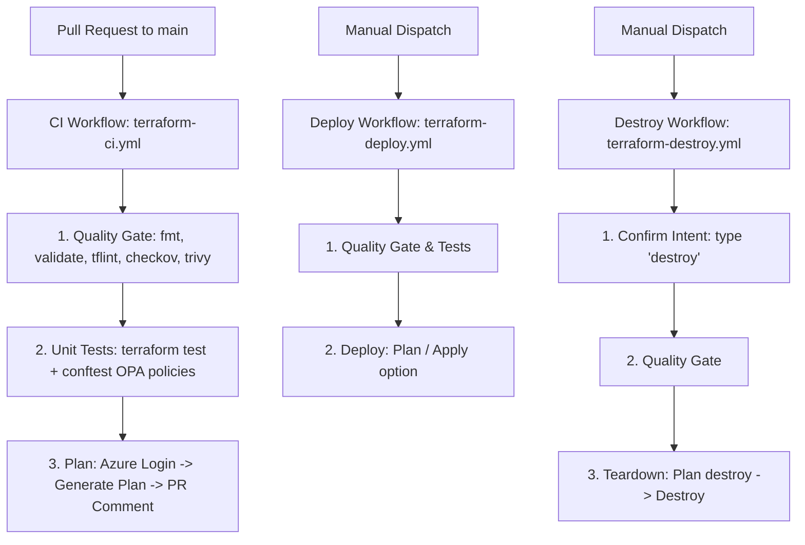

# 🚀 CI/CD Pipeline — GitHub Actions Guide

This repository contains a automated GitOps pipeline using GitHub Actions to manage the lifecycle of your Azure infrastructure.

---

## 🔑 1. Setup Required GitHub Secrets

To allow GitHub Actions to authenticate with Azure and run Terraform, you must add the following **Actions Secrets** to your repository:

### ⚙️ How to Add Secrets:
1. Navigate to your repository on GitHub.
2. Go to **Settings** ➔ **Secrets and variables** ➔ **Actions**.
3. Click **New repository secret** for each variable below.

| Secret Name | Description | How to obtain |
| :--- | :--- | :--- |
| `AZURE_CLIENT_ID` | Service Principal Application ID | `az ad sp create-for-rbac` |
| `AZURE_CLIENT_SECRET` | Service Principal Client Secret | Generated with the service principal |
| `AZURE_SUBSCRIPTION_ID` | Azure Subscription ID | `az account show --query id` |
| `AZURE_TENANT_ID` | Azure Active Directory Tenant ID | `az account show --query tenantId` |
| `TF_VAR_admin_password` | VM Admin recovery password | A strong password meeting Azure complexity rules |

> 💡 *Note: The Service Principal must have `Contributor` role (or higher) on your Azure subscription, as well as `Storage Blob Data Contributor` on the Terraform state Storage Account.*

---

## 🛡️ 2. Configure GitHub Environment (Optional but Recommended)

Both `terraform-deploy.yml` and `terraform-destroy.yml` utilize a GitHub Environment called `sandbox` to allow for approval gates.

### ⚙️ How to Configure:
1. In your GitHub repository, go to **Settings** ➔ **Environments**.
2. Click **New environment** and name it **`sandbox`**.
3. Under **Deployment protection rules**, check **Required reviewers** and add users who must approve before a deploy/destroy runs.

---

## 🔄 3. Pipeline Workflows Overview

---

## 🛠️ 4. Using the Workflows

### 💻 CI Workflow: Pull Request Quality Gate (`terraform-ci.yml`)
* **Trigger:** Automatically runs on every Pull Request targeting `main` containing changes in `terraform/**`, `.tflint.hcl`, or `policies/**`.
* **Actions Performed:**
  * **Fails the build** if formatting (`terraform fmt`) is incorrect, syntax (`terraform validate`) fails, or `tflint` finds errors.
  * Runs security scanning (`Checkov` and `Trivy`) in **warning-only** mode (does not block).
  * Executes mock unit tests (`terraform test`) and evaluates OPA policies (`Conftest`).
  * Generates a Terraform Plan and **posts it directly as a comment** on your Pull Request for review.

---

### 🚀 Deploy Workflow: Plan / Apply (`terraform-deploy.yml`)
* **Trigger:** Manually run from the GitHub Actions UI.
* **How to run:**
  1. Go to **Actions** tab in GitHub.
  2. Click **Deploy Terraform Infrastructure** from the left sidebar.
  3. Click **Run workflow** dropdown on the right.
  4. Choose your branch and select the action:
     * **`plan`**: Dry-run preview of the infrastructure changes (Safe).
     * **`apply`**: Deploys/updates the infrastructure in Azure.
  5. Click the green **Run workflow** button.

---

### 💥 Destroy Workflow: Teardown (`terraform-destroy.yml`)
* **Trigger:** Manually run from the GitHub Actions UI.
* **Safety Features:**
  * **Intent verification**: Requires typing `"destroy"` exactly in the prompt before starting.
  * Performs the quality-gate checks as a safety net before proceeding.
* **How to run:**
  1. Go to **Actions** tab in GitHub.
  2. Click **Destroy Terraform Infrastructure**.
  3. Click **Run workflow** dropdown.
  4. Type **`destroy`** in the confirmation field.
  5. Click **Run workflow**.

---

## ⚠️ Security Best Practices

1. **No Hardcoded Secrets**: Never commit credentials to your code. Use `terraform.tfvars.json` only locally, and let GitHub Actions use Repository Secrets.
2. **Review Plan Comments**: Always read the plan posted by the bot on your Pull Request before merging to `main`.
3. **Artifact Retention**: The generated plan binary (`tfplan`) is uploaded as an artifact for audit trails, retaining for 30 days on PRs and 90 days on deployments.
